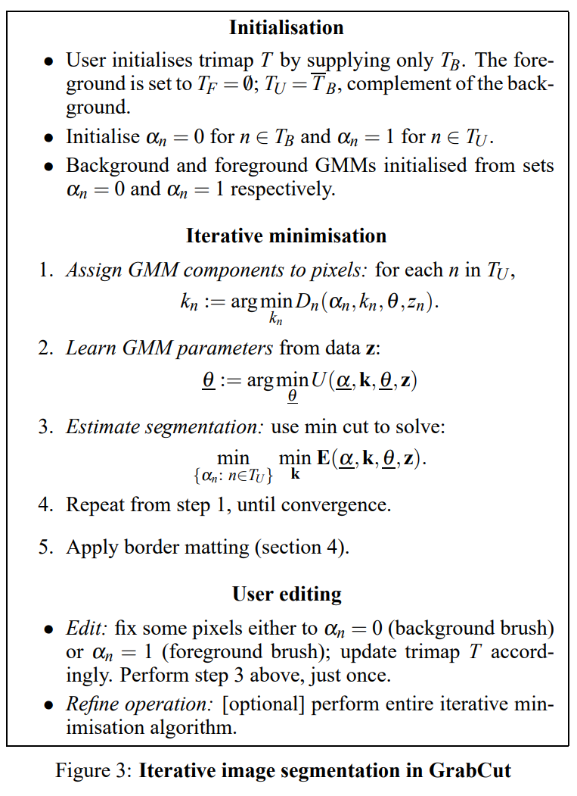
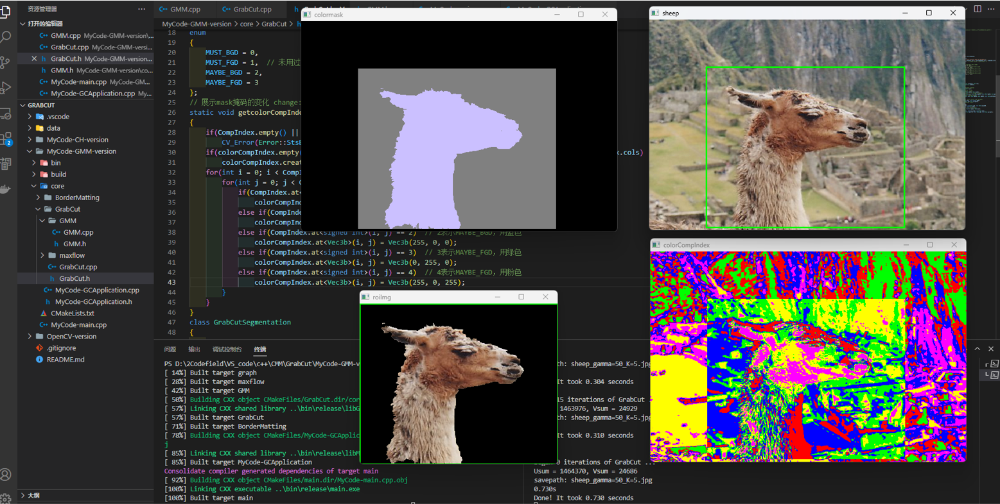

> **任务要求**：使用C++复现[GrabCut论文](https://cvg.ethz.ch/teaching/cvl/2012/grabcut-siggraph04.pdf)，GraphCut部分可调用函数库[Max-flow/min-cut](https://vision.cs.uwaterloo.ca/code/)，图片交互部分可用OpenCV接口。对于400*600图片要求在release模式下，运行时间通常在1s内。

- **文件解释**：
  - [MyCode-GMM-version](./MyCode-GMM-version)：独立实现 `GrabCut` 功能。可在[MyCode-GCApplication.cpp](./MyCode-GMM-version/core/MyCode-GCApplication.cpp)中查看调用的 `gc.GrabCut` 函数
  - [OpenCV-version](./OpenCV-version)：调用OpenCV中接口实现 `GrabCut` 功能。可在[OpenCV-GCApplication.cpp](./OpenCV-version/core/OpenCV-GCApplication.cpp)中查看调用的 `grabCut` 函数


## Install：Opencv(c++) & Cmake

1. 按照[此教程](https://blog.csdn.net/qq_45022687/article/details/120241068)在VScode内搭建OpenCV，注意完全按照他选的版本
2. 学习简单使用cmake关联多文件，并选择release模式（能够看懂我的[CMakeLists.txt](./MyCode-GMM-version/CMakeLists.txt)即可）

## Run

进入[MyCode-GMM-version](./MyCode-GMM-version)文件夹，新建build文件夹

```
mkdir build
cd build
```

编译cmake

```
cmake -G "MinGW Makefiles" -DCMAKE_BUILD_TYPE=Release ..
mingw32-make
```

运行：新建终端，进入[bin/release](./MyCode-GMM-version/bin/release)文件夹，运行程序，选择图片

```
cd .\bin\release\
.\main.exe ../../../data/sheep.jpg
```

## Introduction

GrabCut 是2004年提出的分割算法，基础是 Graph cut 算法，这篇论文回顾了基于 S-T 图的能量优化算法（Graph cut 这篇论文提出了最小化能量函数的优化方法），并关联最小割 (min-cut) 问题进行求解，其中还加入混合高斯模型 (GMM) 对能量项进行优化。

- **我的理解**：
  - 我认为Graph cut提出的能量函数的思想是整个分割算法的核心，它用 E 来表示整幅图片的能量值，分别由区域能量项和边界平滑项两部分组成。
  - 假设将整幅图片想成地图，像素点值大的地方表示海拔高，那我们分割前景背景的界限就是海拔变化大的区域。但是又要从整体图像来分析，不可能遇到一个悬崖就作为分割。因此区域能量项相当于从整体出发，分析整幅地图，找到高原和盆地；而边界平滑项相当于从局部出发，寻找悬崖、峭壁等瞬间变化大的区域。（既保证以大见小，又以小见大。）
  - 而这个算法的最终效果也很大程度取决于平衡整体函数和局部函数的系数 gamma，这块我后面在[ppt](./GrabCut-PPT汇报.pdf)中进行了分析。

- **核心代码**：根据[GrabCut论文](https://cvg.ethz.ch/teaching/cvl/2012/grabcut-siggraph04.pdf)中的算法步骤

  
  
  - 在[GrabCut.cpp](MyCode-GMM-version/core/GrabCut/GrabCut.cpp)的主函数 `GrabCutSegmentation::GrabCut` 中编写核心步骤如下（各函数详细注释可在[GrabCut.cpp](MyCode-GMM-version/core/GrabCut/GrabCut.cpp)中查看）
  
    ```c++
    if(mode == GC_WITH_RECT){
        // 初始化mask
        initMaskWithRect(mask, img.size(), rect);
        // 初始化GMM模型
        initGMMs(img, mask, backgroundGMM, foregroundGMM);
    }
    if(iterCount <= 0) return;
    
    // 计算Beta的值
    const double beta = CalcBeta(img);
    // 计算平滑项(边界能量项V)
    Mat leftWeight, upleftWeight, upWeight, uprightWeight;
    CalcSmoothness(img, beta, gamma, leftWeight, upleftWeight, upWeight, uprightWeight);
    // 存储每个像素属于哪个高斯模型
    Mat ComponentIndex(img.size(), CV_32SC1);
    const double lambda = 8 * gamma + 1;
    for(int i = 0; i < iterCount; i++){
        int vCount = img.cols*img.rows;
        int eCount = 2 * (4 * vCount - 3 * img.cols - 3 * img.rows + 2);  // 无向图=双向图
        Graph<double, double, double> graph(vCount, eCount);  // 建图
        AssignGMMComponents(img, mask, backgroundGMM, foregroundGMM, ComponentIndex);
        LearnGMMParameters(img, mask, backgroundGMM, foregroundGMM, ComponentIndex);
        getGraph(img, mask, backgroundGMM, foregroundGMM, leftWeight, upleftWeight, upWeight, uprightWeight, lambda, graph);
        EstimateSegmentation(graph, mask);
        CalcEneryFunction(graph, mask, leftWeight, upleftWeight, upWeight, uprightWeight);
    }
    ```
  
- **中间结果展示**：

  


## Reference

- 参考论文

  1. [Interactive Graph Cutsfor Optimal Boundary & Region Segmentation  of Objects in N-D Images](https://ieeexplore.ieee.org/document/937505)
  2. ["GrabCut": interactive foreground extraction using iterated graph cuts](https://dl.acm.org/doi/10.1145/1015706.1015720)
  3. [Global contrast based salient region detection](https://ieeexplore.ieee.org/document/6871397)

- 参考笔记

  [GrabCut算法详解：从GMM模型说起_grabcut算法数学表示_lvzelong2014的博客-CSDN博客](https://blog.csdn.net/lvzelong2014/article/details/127616653)

  [读《"GrabCut" -- Interactive Foreground Extraction using Iterated Graph Cuts》 - 知乎 (zhihu.com)](https://zhuanlan.zhihu.com/p/20255114)

  [论文阅读---“GrabCut” — Interactive Foreground Extraction using Iterated Graph Cuts_Blotic，的博客-CSDN博客](https://blog.csdn.net/lmflmfa/article/details/121523272)

  [图像分割之（三）从Graph Cut到Grab Cut_zouxy09的博客-CSDN博客](https://blog.csdn.net/zouxy09/article/details/8534954)

  [图割论文阅读笔记：“GrabCut” — Interactive Foreground Extraction using Iterated Graph Cuts_grabcut论文_充数的竽的博客-CSDN博客](https://blog.csdn.net/shi923281339/article/details/53383715)

  [OpenCV图像分割Grabcut算法_opencv 图像分割算法_知来者逆的博客-CSDN博客](https://blog.csdn.net/matt45m/article/details/103778232)

  [【图像处理】图像分割之（一~四）GraphCut，GrabCut函数使用和源码解读（OpenCV）_苏源流的博客-CSDN博客](https://blog.csdn.net/kyjl888/article/details/78253829)

  [代码清晰：GrabCut与BorderMatting的C++实现_border matting_蹦蹦跳跳小米粒的博客-CSDN博客](https://blog.csdn.net/weixin_41319239/article/details/91492277?spm=1001.2014.3001.5506)

  [原理清晰：GrabCut算法详解：从GMM模型说起_grabcut::buildgmms_lvzelong2014的博客-CSDN博客](https://blog.csdn.net/lvzelong2014/article/details/127616653)

  [原理清晰：From GMM to GrabCut_grabcut gmm_三分明月落的博客-CSDN博客](https://blog.csdn.net/qq_40755643/article/details/89480003?spm=1001.2014.3001.5506)

  [比较HC：四种比较简单的图像显著性区域特征提取方法原理及实现-----> AC/HC/LC/FT。 - Imageshop - 博客园 (cnblogs.com)](https://www.cnblogs.com/Imageshop/p/3889332.html)

  [HC(Histogram-based Contrast) 基于直方图对比度的显著性 - yfor - 博客园 (cnblogs.com)](https://www.cnblogs.com/yfor1008/p/15404627.html)

- 参考代码

  [MatthewLQM/GrabCut: This is an implement of GrabCut. (github.com)](https://github.com/MatthewLQM/GrabCut/tree/master)

  [MaxtirError/GrabCut: pure C++ method implement GrabCut algorithm (github.com)](https://github.com/MaxtirError/GrabCut)

  [bittnt/ImageSpirit (github.com)](https://github.com/bittnt/ImageSpirit)

- 参考讲解

  [GrabCut_哔哩哔哩_bilibili](https://www.bilibili.com/video/BV1w44y1f7zy/?vd_source=05f97c55a318d0682c7cce673cbb8506)

  [数字图像处理实验演示 - 43. GrabCut 人物分割与背景替换_哔哩哔哩_bilibili](https://www.bilibili.com/video/BV1Bq4y1h7Zz/?spm_id_from=333.337.search-card.all.click&vd_source=05f97c55a318d0682c7cce673cbb8506)